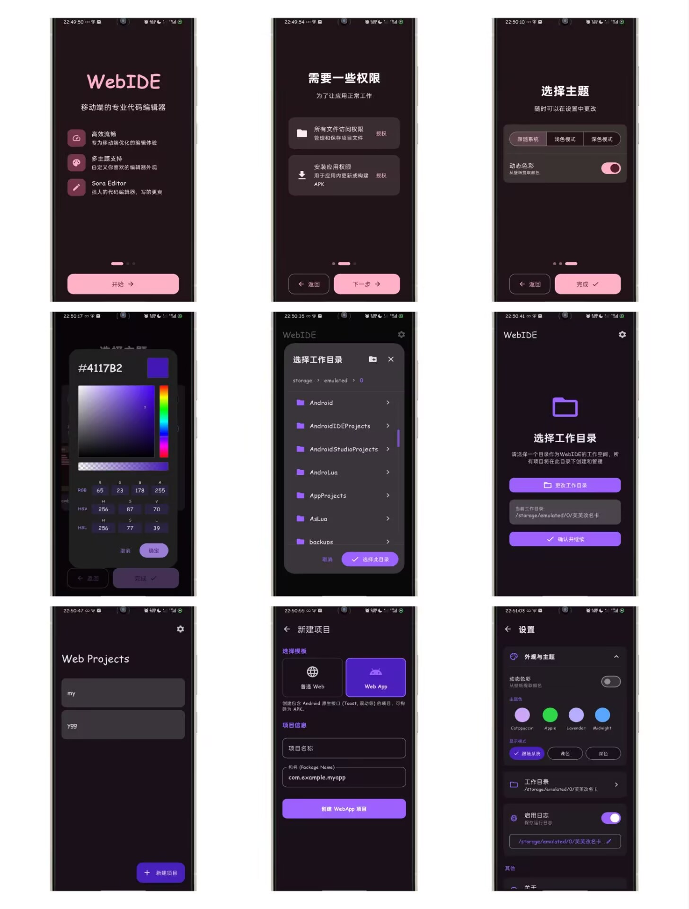
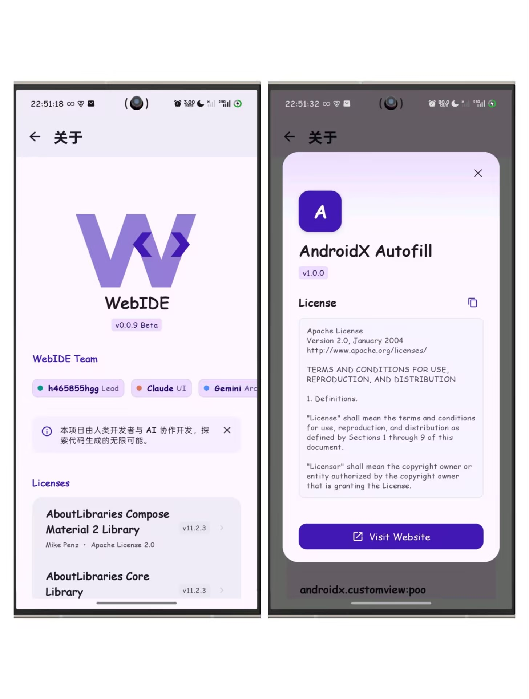

> 这个仓库将作为WebIDE的构建CI版本仓库,此举实属无奈,不开源了也很抱歉

  语言: 
  <a href="./README.md">English</a>
  简体中文

# WebIDE

WebIDE 是一个基于 Android 原生的 Web 前端集成开发环境。该项目完全采用 Jetpack Compose 构建，实现了从代码编辑到在手机上直接构建 APK 的完整工作流。

这是一个实验性的工程项目，其核心架构与代码逻辑由多个 AI 模型（Claude, Gemini, DeepSeek）协作完成。

## 项目截图

  
  

## 功能特性

*   **语法高亮**: 基于 TextMate 语法文件，完美支持 HTML, CSS, JavaScript 和 JSON。
*   **项目管理**: 完整的文件系统访问权限，支持多文件 Web 项目的创建与管理。
*   **实时预览**: 集成 WebView 预览环境，支持 JavaScript 交互测试。
*   **现代化 UI**: 100% 使用 Kotlin 和 Jetpack Compose 编写，支持动态主题。

## 讨论

* QQ群:[1050254184](https://qm.qq.com/q/tFXuqMQDlK)

## 贡献者

